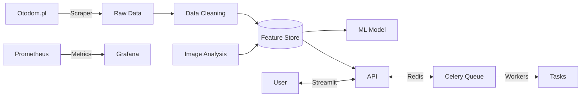

<div align="center">
  <h1>🏠 Real Estate Agent v2</h1>
  
  [](https://www.python.org/)
  [](LICENSE)
  [](https://github.com/psf/black)
  [](https://docs.celeryq.dev/)
  [](https://fastapi.tiangolo.com/)
  [](https://mlflow.org/)
</div>

**Endüstriyel ölçekte Otodom.pl veri toplama, zenginleştirme ve makine öğrenimi platformu**



*Sistem Mimarisi - [Detaylar için tıklayın](docs/ARCHITECTURE.md)*

**Otodom.pl çok-kanallı veri toplama, zenginleştirme, makine öğrenimi ve servis altyapısı**

Bu repo; konut ilanlarını toplar, eksiksiz alan doldurma ve görsel analizle zenginleştirir, veri ambarına kaydeder ve tahmin API’si / Streamlit UI üzerinden sunar. Celery & Redis ile paralel çalışan görevler, Prometheus ile gözlemlenebilirlik ve Feast feature-store entegrasyonunu içerir.

---
## Özellikler
| Modül | Açıklama |
|-------|----------|
| **Scraper (Otodom)** | Çok sayfalı liste & detay çekimi, Offer API + GraphQL ile tam alan seti, eksik alan doldurma (`_fill_missing_fields`) |
| **Görsel Analiz** | Google Gemini veya OpenAI Vision üzerinden oda sınıflandırma, kalite skoru, renk & obje tespiti; Sonuçlar JSON + DB |
| **Veri Kalitesi** | Zorunlu alan listesi, NULL önleme, coğrafi kodlama (Geopy), detay URL onarımı |
| **ML Pipeline** | Feature engineering, Optuna HPO, XGBoost / CatBoost, SHAP açıklanabilirlik, model sürümleme (MLflow) |
| **Feature Store** | Feast (Redis) ile görsel + temel özelliklerin çevrim-içi/çevrim-dışı saklanması |
| **Servis Katmanı** | FastAPI (REST) & Streamlit (UI), tahmin, benzer ilan önerileri, ROI, rapor PDF/JSON |
| **Görev Kuyruğu** | Celery + Redis; scraper, görsel analiz, veri temizleme, model güncelleme görevleri |
| **Observability** | Prometheus metrics, OpenTelemetry tracing, Grafana dashboard |
| **CI/CD** | pytest + coverage, flake8, pre-commit; GitHub Actions pipeline (opsiyonel) |

---
## Dizin Yapısı (özet)
```
real_estate_agent_v2/
├── back_end/            # Scraper, Celery, DB modelleri, servis kodu
│   ├── otodom_scraper.py
│   ├── store_listings.py
│   └── ...
├── models/              # Eğitilmiş modeller, MLflow artefaktları
├── feature_store/       # Feast repo (offline/online)
├── front_end/           # Streamlit UI + statik dosyalar (varsa)
├── docker/              # Dockerfile, docker-compose.yml, k8s manifestleri
├── tests/               # Birim ve entegrasyon testleri
├── requirements.txt     # Python 3.11 bağımlılıkları
└── README.md            # (bu dosya)
```

---
## Kurulum
### 1. Python Ortamı
```bash
python3.11 -m venv venv
source venv/bin/activate
pip install --upgrade pip wheel setuptools
pip install -r requirements.txt
```

### 2. Redis & Prometheus
En hızlı başlatma için Docker Compose:
```bash
docker compose -f docker/docker-compose.local.yml up -d redis prometheus grafana
```

### 3. Veri Tabanı
```bash
# SQLite (varsayılan)
python - <<'PY'
from back_end.db import Base, engine
Base.metadata.create_all(engine)
PY
```

---
## Kullanım
### Scraper Çalıştırma (Batch)
```bash
python back_end/store_listings.py \
  --search-url "https://www.otodom.pl/pl/wyniki/sprzedaz/mieszkanie/..." \
  --pages 50 --save-csv data/otodom.csv
```

### Celery Worker + Scheduler
```bash
celery -A back_end.celery_app worker -l info -Q default,image_tasks &
celery -A back_end.celery_app beat   -l info &
```

### FastAPI Servisini Başlatma
```bash
uvicorn back_end.api:app --host 0.0.0.0 --port 8000
```

### Streamlit UI
```bash
streamlit run front_end/app.py
```

---
## Docker
```bash
# Tüm stack: scraper, api, celery, redis, prometheus, grafana
docker compose -f docker/docker-compose.local.yml up --build
```

---
## Test
```bash
pytest -q tests/
```

---
## Geliştirme İpuçları
- `pre-commit install` ⇒ otomatik flake8, isort, black formatlama
- `make lint` & `make test` kısayolları
- Ortam değişkenleri `.env` dosyasında
- Uzun görevler için Celery task retry/backoff mantığı hazırdır.

---
## 📚 API Referansı

```http
GET /api/v1/listings?city=Wrocław&min_price=300000

# Yanıt
{
  "results": [{
    "id": "123",
    "title": "Spacious 3-bedroom apartment in Wrocław",
    "price": 450000,
    "predicted_price": 438000,
    "roi": 6.2,
    "image_analysis": { ... }
  }]
}
```

Detaylı API dokümantasyonu: `http://localhost:8000/docs` (Swagger UI)

## 🤝 Katkı

1. Fork'layın ve `develop` branch'ine geçin:
   ```bash
   git checkout -b feature/your-feature-name
   ```
2. Kodunuzu yazın, test edin (`pytest -v`)
3. Formatlama yapın: `make format`
4. PR açarken şablonu doldurun

## 📜 Lisans

Bu proje [MIT Lisansı](LICENSE) altında lisanslanmıştır.

---
<div align="center">
  <sub>Built with ❤️ by Real Estate Team | 2025</sub>
</div>
