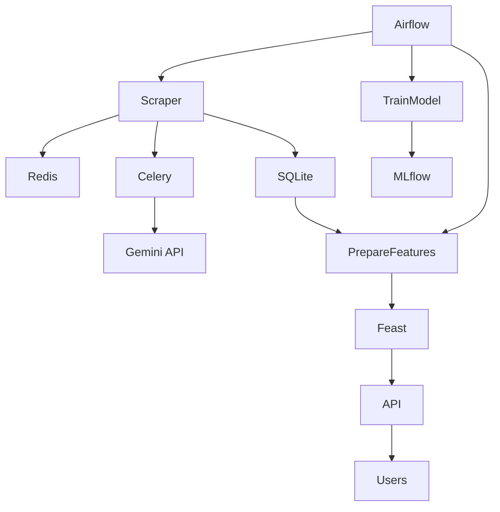

# Architecture

```mermaid
flowchart TD
    Scraper-->Redis
    Scraper-->SQLite
    Scraper-->Celery
    Celery-->Gemini[Gemini API]
    SQLite-->PrepareFeatures
    PrepareFeatures-->Feast
    Feast-->API
    API-->Users
    Airflow-->Scraper
    Airflow-->PrepareFeatures
    Airflow-->TrainModel
    TrainModel-->MLflow
```
